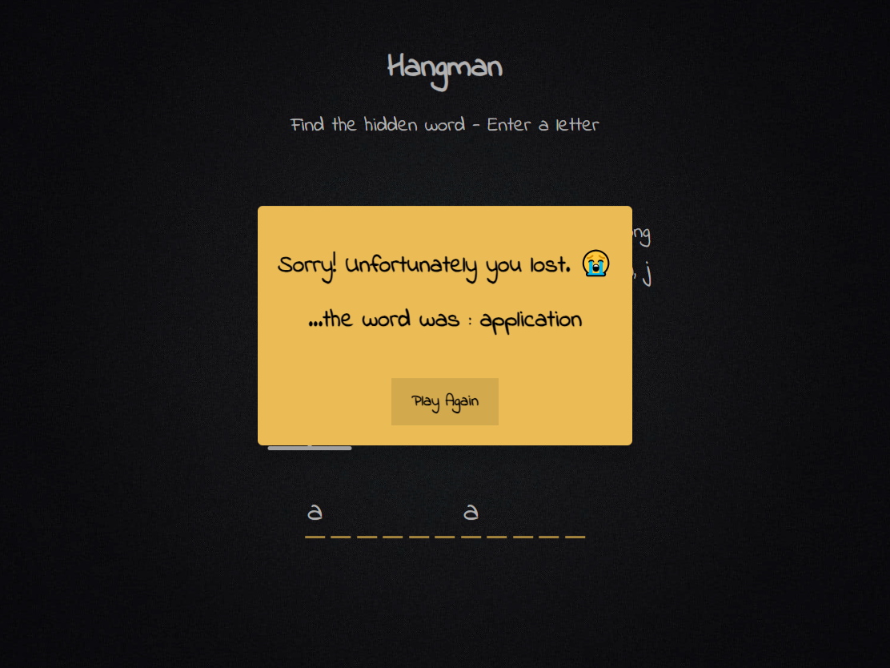
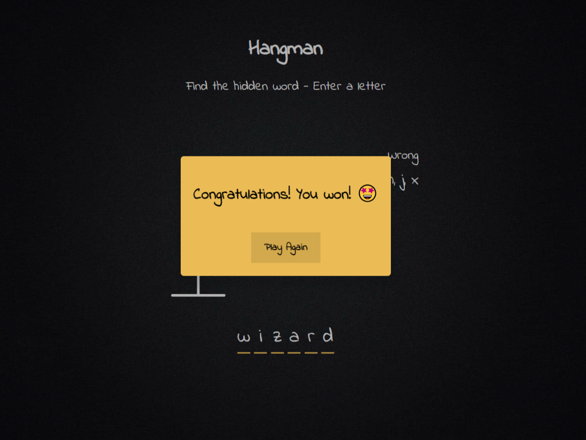

# The Hangman game

The Hangman game provides a fun experience for players to test their word-guessing skills. With its intuitive interface and clear win/loss conditions, players can enjoy a classic game without unnecessary complexity.

It is based on a tutorial from [20 Web Projects With Vanilla JavaScript Course](https://www.udemy.com/course/web-projects-with-vanilla-javascript/?couponCode=GENAISALE24)

## Table of contents

- [Overview](#overview)
  - [Screenshot](#screenshot)
  - [Links](#links)
- [Built with](#built-with)

## Overview

Hangman is a user-friendly word-guessing game where the objective is to guess a hidden word by typing letters on your keyboard. You have 6 chances to guess incorrectly before you lose. If you guess the word correctly within those chances, you win the game. After winning or losing, you can restart the game with a simple button press.

### Screenshot

### Links

- Live Site URL:

### Built with

- HTML
- CSS
- JavaScript
